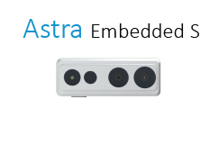

## 1. Download SDK and Documentation
[SDK&Demo download](https://www.dropbox.com/s/l9sawllbmvqo4ld/OpenNI_2.3.0.63.tar.gz?dl=0)
中国大陆地区请访问[百度网盘](https://pan.baidu.com/s/1iAEpE-VqfqY4Y2vPQm5aSQ)，提取码: be87

## 2. We choose Arm64 and make the example as follows:

### To run visual samples(e.g., SimpleViewer), you will need freeglut3 header and libaries, please install:

```
$ sudo apt-get install build-essential freeglut3 freeglut3-dev
```

check udev version, Orbbec Driver need libudev.so.1, if can't find it, can make symbolic link from libudev.so.x.x,
which usually locate in /lib/x86_64-linux-gnu or /lib/i386-linux-gnu
```
$ldconfig -p | grep libudev.so.1
$cd /lib/aarch64-linux-gnu
$sudo ln -s libudev.so.x.x.x libudev.so.1
```

### copy tgz file to any place you want(e.g., Home)

### unzip tgz file
```
$ tar zxvf OpenNI_2.3.0.63.tar.gz
$ cd OpenNI_2.3.0.63/Linux/OpenNI-Linux-Arm64-2.3.0.63
```

# run install.sh to generate OpenNIDevEnvironment, which contains OpenNI development environment (run sudo chmod 777 install.sh for elevated permission)

```
$ sudo ./install.sh
```

* please replug in the device for usb-register

## add environment variables
```
$ source OpenNIDevEnvironment
```

# build sample(e.g., SimpleViewer)
```
$ cd Samples/SimpleViewer
$ make
```

## run sample
connect sensor
```
$ cd Bin/Arm64-Release
$ ./SimpleViewer
```

now you should be able to see a GUI window showing the depth stream video


* for using with Astra Embedded S/Stereo S


please change the resolution in 'orbbec.ini' to 'Resolution=17' for Depth and IR streams

## Documentation
```
OpenNI_2.3.0.63/Windows/Astra OpenNI2 Development Instruction(x64)_V1.3/OpenNI2/OpenNI-Windows-x64-2.3.0.63/Documentation/OpenNI.chm
```


